# 🤿 MN90 Mobile

**Le hub d’outils de plongée FFESSM, pensé pour le téléphone.**
Tables MN90, Nitrox, DTR et pression de décollage, procédures d’urgence et simulateur 3D, avec des explications simples pour tous les niveaux.

👉 **[Ouvrir l’application](https://soaresden.github.io/MN90Mobile/)** · ⌚ **[Télécharger la version montre (Wear OS)](https://github.com/soaresden/MN90Mobile/releases/latest/download/MN90-Montre.apk)**

> ⚠️ Outil d’entraînement et de préparation. Il ne remplace ni ta formation, ni ton ordinateur de plongée, ni les consignes de ton directeur de plongée.

<p align="center">
  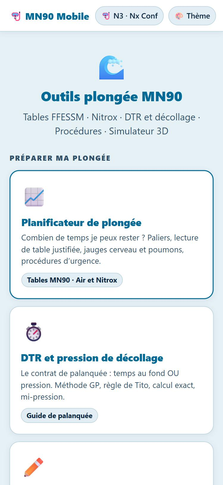
  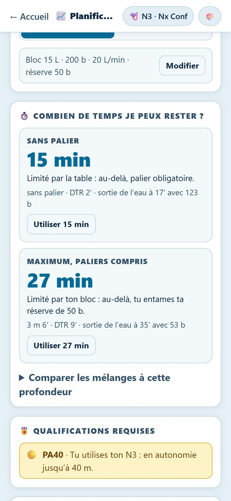
  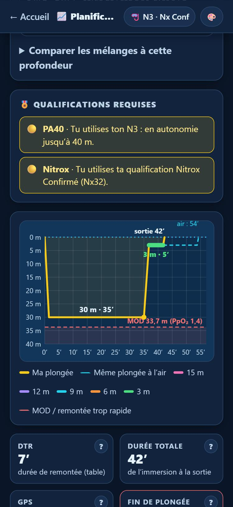
</p>

---

## 🤿 Ton profil plongeur

Au premier lancement d’un outil, l’application te demande ton profil. Il est gardé **uniquement dans ton téléphone** et sert dans tous les outils :

- ton **niveau** (N1, N2, N3, N4/GP, moniteur) et tes **qualifications** en plus (PA12, PE40, PA40, PE60) ;
- ta qualification **Nitrox** ou **Nitrox Confirmé** ;
- ton **bloc**, ta **pression de départ**, ta **consommation** et ta **réserve**.

Pour chaque plongée, l’application affiche les qualifications requises :

| Couleur | Signification |
|---|---|
| 🟡 Jaune | La plongée **utilise** une de tes qualifications (« Tu utilises ton N3 : en autonomie jusqu’à 60 m ») |
| ⛔ Rouge | La plongée est **hors de tes prérogatives** (« 41 m en autonomie demande PA60. Niveau 2 : 20 m max en autonomie ») |

Les prérogatives suivent le Code du sport (annexes III-16 b pour l’air, III-17 c pour le Nitrox) : au Nitrox, les profondeurs restent celles de ton niveau, dans la limite de 60 m. Au-delà de 40 % d’O₂, le Nitrox Confirmé est obligatoire.

<p align="center">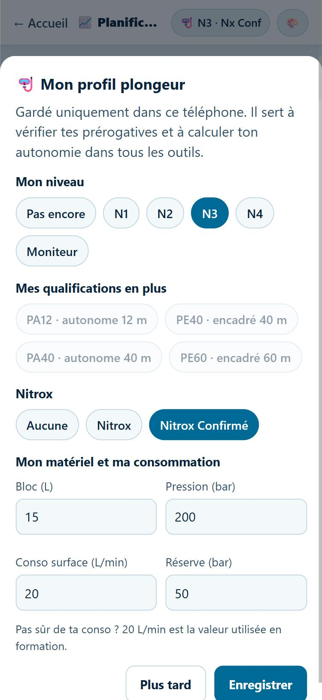</p>

---

## 📈 Le planificateur de plongée

Tu choisis ta profondeur, ta durée, ton gaz (air ou Nitrox) et si tu plonges encadré ou en autonomie. Tout se recalcule en direct.

**⏱️ Combien de temps je peux rester ?** C’est la première question, et la réponse s’affiche en haut :

- **Sans palier** : la durée max sans palier obligatoire ;
- **Maximum, paliers compris** : la durée max avant d’entamer ta réserve, paliers inclus ;
- et **ce qui te limite** : la table, ton bloc, l’oxygène (%SNC) ou les 2 h d’immersion.

Un tableau compare d’un coup d’œil l’air, le Nx32, le Nx36 et le Nx40 à cette profondeur. Exemple à 27 m avec un 15 L : 15 min sans palier à l’air, mais 29 min sans palier au Nx32.

**📊 La courbe** montre la descente, le fond, la remontée et les paliers, colorés par profondeur. Au Nitrox, elle ajoute la zone interdite sous la MOD et la même plongée à l’air en pointillés. Au survol, tu vois l’heure, la profondeur et la PpO₂.

**Les indicateurs**, rangés par catégorie :

| Catégorie | Indicateurs |
|---|---|
| ⏱️ Temps | DTR, durée totale, lettre GPS |
| 🫧 Air | pression en fin de plongée, pression de décollage |
| 🧪 Gaz | PpO₂, PEA, MOD |
| 🧠 Corps | %SNC, narcose (PpN₂) |

Le bouton **?** d’un indicateur l’explique simplement, avec tes chiffres. **Un clic sur l’indicateur** ouvre l’onglet **🧮 Calculs**, qui détaille son calcul pas à pas : conso phase par phase, %SNC segment par segment, PEA, décollage…

Sur un ordinateur, le planificateur tient dans l’écran sans défiler, sur trois colonnes : réglages, courbe et indicateurs, panneau à onglets (Alertes, Calculs, Table, Contrat, Corps, Urgence, Mélanges).

**🧠 🫁 Ce que l’oxygène fait à ton corps** : deux jauges qui se remplissent.

- **Cerveau (%SNC)** : la dose d’oxygène reçue par le cerveau, d’après la table NOAA. À 100 %, c’est la dose max de la journée. L’alerte apparaît à 50 % et la limite est à 80 %.
- **Poumons (OTU)** : l’irritation des poumons par l’oxygène, sur 850 OTU par jour.

**📖 Lecture de la table** : l’extrait de la table MN90 utilisé, avec la ligne retenue surlignée. Chaque étape est justifiée : pourquoi cette profondeur (toujours celle immédiatement supérieure), pourquoi cette durée, quels paliers, d’où vient la DTR, ce que veut dire la lettre GPS. Au Nitrox, le calcul de la PEA s’affiche avant.

<p align="center">
  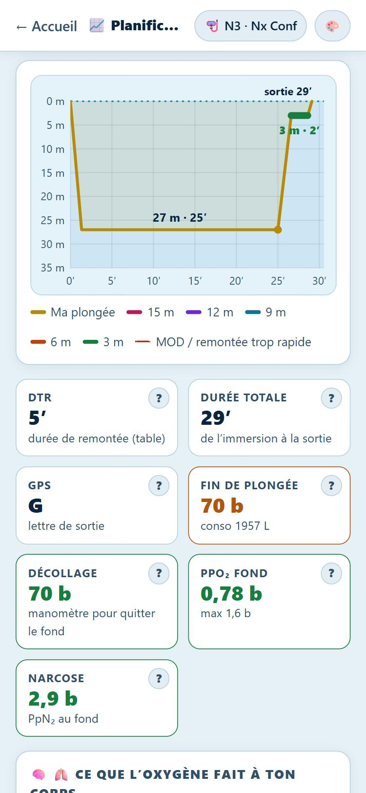
  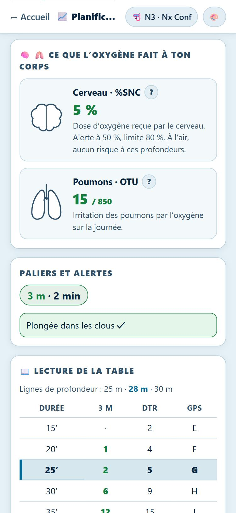
  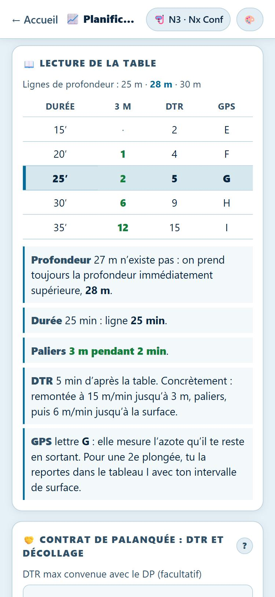
</p>

---

## 🤝 Le contrat de palanquée : DTR et décollage

Avant de plonger, on passe un contrat : **un temps au fond OU une pression au manomètre. Le premier des deux qui arrive fait décoller.**

Exemple à 60 m avec un 15 L : 10 min au fond OU 90 b.

- **DTR** : lue dans la table. La méthode GP rapide compte la pression absolue du fond en minutes, plus les paliers. ⚠️ La DTR n’est pas le temps au fond.
- **DTR max convenue avec le DP** : l’application te dit combien de temps tu peux rester au fond pour la respecter.
- **Pression de décollage**, calculée de trois façons :
  - **méthode GP** : DTR × β + pression de sécurité. β vaut 3 b/min pour un 15 L et 4 pour un 12 L à 20 L/min, d’après la table de L. Bardassier ;
  - **calcul exact** : le gaz réellement consommé pendant toute la remontée ;
  - **règle de Tito** : profondeur + 2 × DTR, arrondie à la dizaine supérieure. L’application te prévient quand elle est insuffisante (par exemple avec un 12 L).
- **Mi-pression**, et **sécu paliers** (est-ce que j’aurai assez d’air au départ du fond ?).
- **Consommation phase par phase** : descente, fond, remontée, chaque palier.

<p align="center">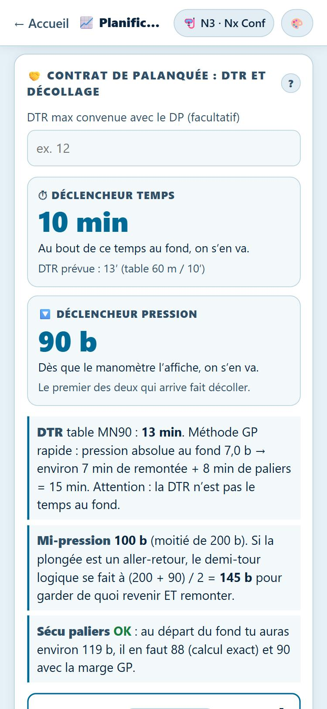</p>

---

## ✏️ Je dessine ma plongée

Tu dessines ton profil au doigt ou à la souris :

- **toucher** le graphique ajoute un point ;
- **glisser** déplace un point ;
- **double-toucher** ou **appui long** supprime un point.

Le dernier point est ton **départ du fond**. La remontée et les paliers s’ajoutent tout seuls, en pointillés. Tous les calculs se font en temps réel : la table est lue à la profondeur max et à la durée jusqu’au départ du fond. Une **remontée de plus de 15 m/min** entre deux points s’affiche en rouge.

<p align="center">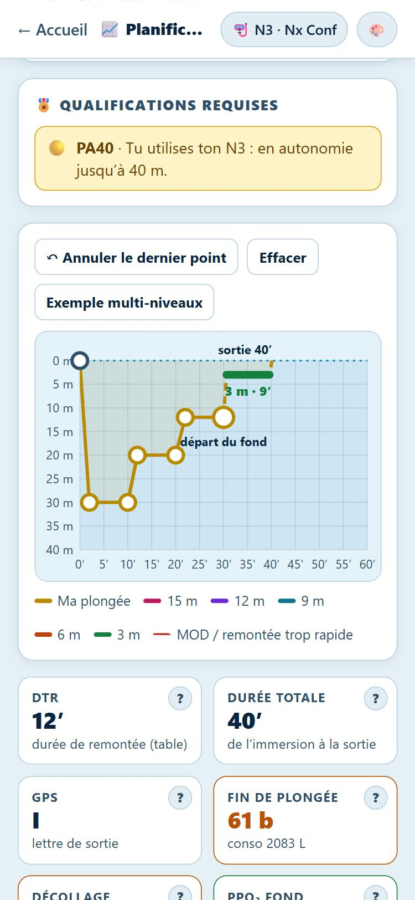</p>

---

## 🚨 Si ça tourne mal : procédures MN90

Les procédures sont calculées pour la plongée affichée, d’après le mode d’emploi des tables fédérales :

- **Remontée rapide** (plus de 15 à 17 m/min), si la réimmersion est possible en moins de 3 min :
  - redescendre à la **demi-profondeur** ;
  - faire un **palier de 5 min** ;
  - compter la nouvelle durée de plongée et lire les nouveaux paliers, avec **au moins 2 min à 3 m**.

  Une courbe montre la procédure.
- **Palier interrompu** : dans les 3 min, redescendre au palier et le refaire entièrement.
- **Remontée lente** : ajouter la durée de remontée à la durée de plongée.
- **Panne d’ordinateur** :
  - suivre l’ordinateur du binôme ;
  - sinon, rester entre 3 et 6 m jusqu’à la pression de réserve. L’application calcule combien de minutes cela représente.
- Et toujours : **oxygène, alerte (196 en mer, 112 à terre), évacuation** si le moindre symptôme apparaît.

Les procédures sont **accessibles depuis tous les outils** avec le bouton rouge **🚨 Procédures** de la barre du haut. Il ouvre une page dédiée avec une fiche réflexe accident et les procédures calculées pour la plongée que tu y règles.

<p align="center">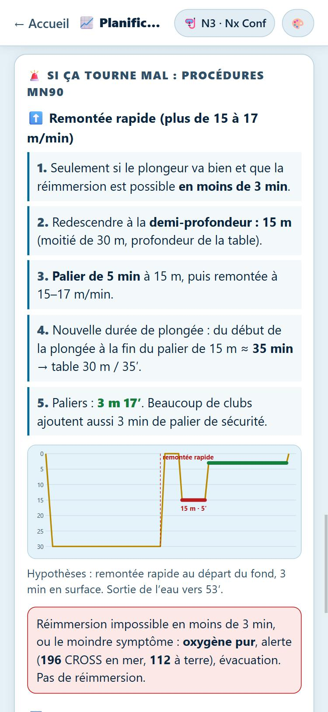</p>

---

## ⚗️ Nitrox

- **Mon mélange** : la MOD à 1,4, 1,5 et 1,6 b, arrondie vers le bas, avec le calcul détaillé et la courbe de MOD selon le % d’O₂.
- **Ma profondeur** : le **best mix** et la liste des mélanges utilisables, avec leur PpO₂, leur MOD et leur PEA (et la ligne de table retenue).
- **Toxicité** : le %SNC par minute selon la PpO₂, d’après la table NOAA. On y voit bien le saut entre 1,5 et 1,6 b, d’où l’intérêt de calculer le best mix à 1,5 b.
- **📋 Ma table de plongée pour ce Nitrox**, en un clic : la MN90 réécrite en **profondeurs réelles** pour ton mélange, jusqu’à sa MOD. Chaque profondeur est lue à sa PEA, comme les tables spécifiques Nitrox du cours. Pour chaque profondeur :
  - la durée sans palier au Nitrox et à l’air, et le gain ;
  - toutes les durées avec leurs paliers, la DTR **réelle** et la lettre GPS.

  La table s’imprime ou s’enregistre en PDF.

Le mélange se règle de 21 à 100 % d’O₂. Au-delà de 40 %, la qualification Nitrox Confirmé s’affiche en jaune si tu l’as, en rouge sinon.

<p align="center">
  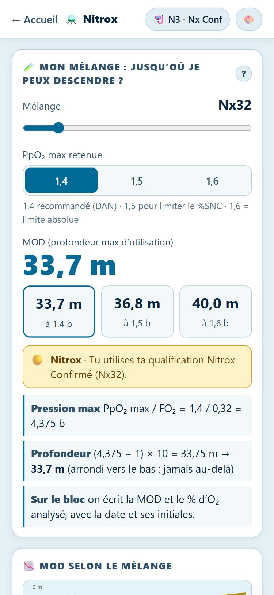
  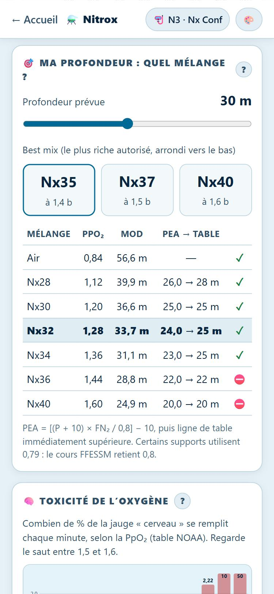
  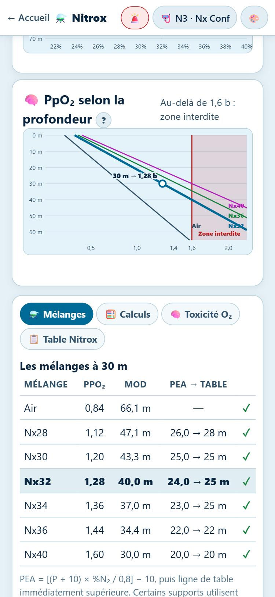
</p>

---

## 🦺 Remontée assistée 3D

Un simulateur de sauvetage en temps réel (Three.js), avec 4 sites (Roussay, St-Pierre, Fosse VLG, Nemo 33). Tu dois gérer la flottabilité, la vitesse de remontée, le palier et le tour d’horizon en surface. À jouer en paysage.

<p align="center">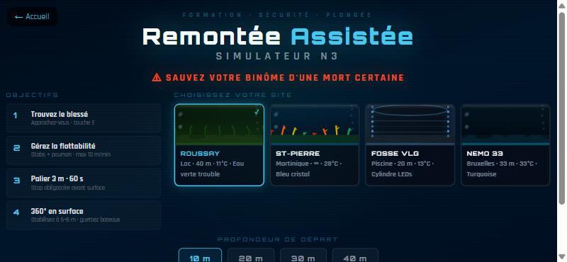</p>

---

## ⌚ La version montre (Wear OS)

Sur la montre, **une question, une réponse**. Tu règles les valeurs avec de gros boutons − / +, et le résultat s’affiche en grand :

| Question | Réponse affichée |
|---|---|
| ⏱️ Combien de temps je peux rester ? | sans palier · maximum (et ce qui limite) |
| ⬆️ Quels paliers ? | paliers colorés, DTR, lettre GPS |
| 🔽 Quand je décolle du fond ? | pression de décollage OU temps au fond |
| 🧪 Jusqu’où avec mon mélange ? | MOD |
| 🎯 Quel mélange pour ma profondeur ? | best mix |
| 🚨 Remontée rapide : que faire ? | demi-profondeur, 5 min, nouveaux paliers |
| ⚙️ Mon matériel | bloc, pression, conso, réserve (gardés sur la montre) |

L’appli fonctionne **sans téléphone et sans réseau**, et utilise exactement les mêmes calculs que le site. La couronne fait défiler, et le geste retour ramène à la liste des questions. Tu peux aussi l’essayer dans un navigateur : [soaresden.github.io/MN90Mobile/watch/](https://soaresden.github.io/MN90Mobile/watch/).

**Installer l’APK sur la montre** (Wear OS 3 ou plus récent) :

1. Télécharge **[MN90-Montre.apk](https://github.com/soaresden/MN90Mobile/releases/latest/download/MN90-Montre.apk)**.
2. Active les options développeur sur la montre : **Paramètres → Système → À propos → Versions**, puis touche 7 fois **Numéro de build**.
3. Dans **Options pour les développeurs**, active **Débogage ADB** et **Débogage sans fil**.
4. Installe l’APK, au choix :
   - **depuis le téléphone**, avec une appli comme *Wear Installer 2* ou *Bugjaeger* : choisis le fichier téléchargé, puis entre l’adresse IP affichée par la montre ;
   - **depuis un PC** : tape `adb connect <ip-de-la-montre>:<port>`, puis `adb install MN90-Montre.apk`.

---

## 🎨 Thèmes et conventions de couleurs

Quinze thèmes, communs à tous les outils et choisis avec le bouton 🎨 :

- ☀️ **Sous-marin clair** (par défaut)
- 🌑 Nuit
- 🌊 Grands fonds
- 🌅 Coucher de soleil
- 🎗️ Octobre rose
- 🏖️ Ouistreham
- 🐢 Tortue
- 🐉 Hippocampe
- 🦐 Crevette
- 🐌 Nudibranche
- 🐡 Poisson-globe
- 🐠 Poisson-clown
- 🦎 Axolotl
- 🦑 Créature des abysses
- 🦕 Loch Ness

Les couleurs des paliers et des alertes sont les mêmes dans tous les thèmes, pour rester lisibles.

| Paliers | Couleur | | Courbes | Couleur |
|---|---|---|---|---|
| 3 m | 🟢 vert | | C1 (ma plongée) | 🟡 jaune |
| 6 m | 🟠 orange | | C2 | 🟢 vert |
| 9 m | 🔵 cyan | | C3 | 🟣 magenta |
| 12 m | 🟣 violet | | C4 (comparaison air) | 🔵 cyan |
| 15 m | 🩷 magenta | | | |

---

## 🧮 Règles de calcul

| Élément | Règle retenue |
|---|---|
| Tables | MN90 FFESSM de 6 à 65 m (62 et 65 m : tables de secours), d’après le document de J.-L. Blanchard et F. Imbert |
| Lecture | Profondeur et durée **immédiatement supérieures**, sans interpolation |
| Vitesses | Descente 20 m/min · remontée 15 m/min jusqu’au 1er palier · 6 m/min entre paliers et jusqu’à la surface |
| PEA | [(P + 10) × %N₂ / 0,8] − 10 (pression absolue, diviseur 0,8 comme dans le cours FFESSM) |
| MOD | (PpO₂ max / %O₂ − 1) × 10, arrondie vers le bas |
| Best mix | PpO₂ max / Pabs, arrondi vers le bas |
| PpO₂ max | Au Nitrox : 1,4 b par défaut (DAN), 1,5 ou 1,6 au choix · à l’air : 1,6 b |
| Consommation | Conso surface × pression absolue moyenne, segment par segment, paliers compris |
| %SNC | Table NOAA de 0,6 à 1,8 b (ligne immédiatement supérieure) |
| OTU | ((PpO₂ − 0,5) / 0,5)^0,83 par minute, limite 850 par jour |
| Immersion | 2 h maximum |
| Prérogatives | Code du sport, annexes III-16 b (air) et III-17 c (Nitrox), 60 m maximum |

---

## 📁 Structure du projet

Du HTML, du CSS et du JavaScript purs : aucune compilation, aucun framework.

```
index.html          menu principal du hub
shared/
  style.css         design system et 15 thèmes
  theme.js          choix du thème (gardé dans le téléphone)
  mn90.js           tables MN90 et tous les calculs (une seule source)
  profile.js        profil plongeur et prérogatives
  glossary.js       explications simples de chaque terme
  procedures.js     procédures MN90 et fiche réflexe accident
planner/            planificateur (paramètres, dessin libre, contrat, calculs)
nitrox/             outil Nitrox et générateur de table
procedures/         page Procédures (bouton 🚨)
watch/              interface montre (une question, une réponse)
wear/               projet Android Wear OS qui embarque watch/ et mn90.js
tools/build-wear.ps1  compile l’APK montre (et publie la release avec -Publish)
3dassist/           simulateur de remontée assistée 3D
dtr/, decomp/       anciennes adresses, redirigées vers le planificateur
diverflap/          mini-jeu mis de côté
```

Pour le lancer en local, sers le dossier avec n’importe quel serveur statique :

```bash
python -m http.server 8090
```

puis ouvre `http://127.0.0.1:8090/`.

---

MN90 Mobile · Soaresden · 2025-2026
