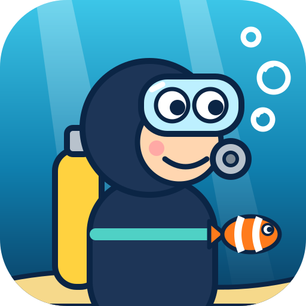
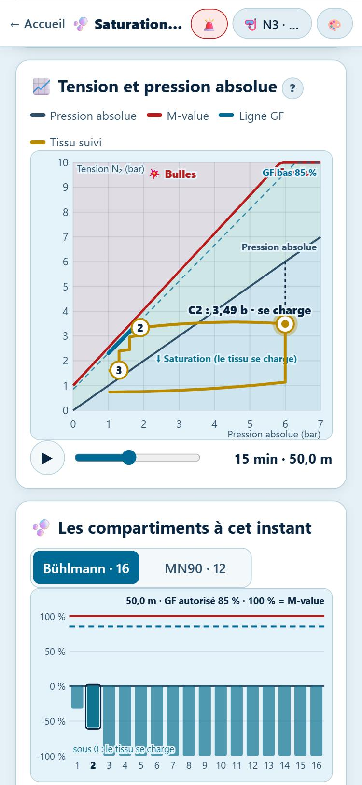
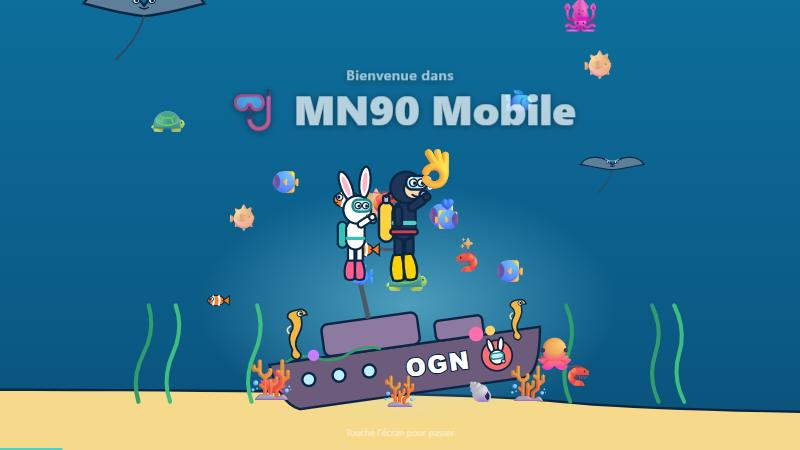
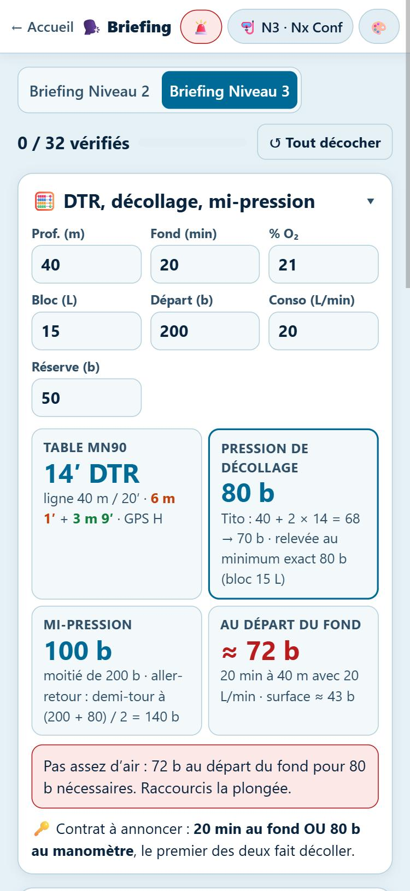

<p align="center"></p>

<h1 align="center">MN90 Mobile</h1>

**Mon hub d’outils de plongée, construit au fil de mon parcours de plongeur FFESSM.**

J’ai commencé ce projet pour moi. Chaque fois qu’une formation m’a appris quelque chose (lire les tables, préparer un contrat de palanquée, plonger au Nitrox, comprendre la saturation), j’en ai fait un outil. Je m’en sers aussi pour mes briefings et mes plongées. Tout ce qui est ici vient donc de mon expérience et des cours de mon niveau : tables MN90, Nitrox et Nitrox Confirmé, procédures, briefings N2 et N3. Les calculs reprennent les méthodes enseignées à la FFESSM.

👉 **[Ouvrir l’application](https://soaresden.github.io/MN90Mobile/)** · ⌚ **[Télécharger la version montre (Wear OS)](https://github.com/soaresden/MN90Mobile/releases/latest/download/MN90-Montre.apk)**

> ⚠️ Outil d’entraînement et de préparation. Il ne remplace ni ta formation, ni ton ordinateur de plongée, ni les consignes de ton directeur de plongée.

<p align="center">
  
  
  
</p>

---

## 🐰 À l’ouverture

Chaque ouverture de l’accueil lance une petite animation de 8 secondes. Pour la passer, il suffit de toucher l’écran.

- Le plongeur fait un saut droit depuis le ponton, suivi de près par le **lapin plongeur de la section plongée de l’Olympic Garennois Natation**, mon club. Les deux entrées dans l’eau font jaillir l’éclaboussure bleue du club.
- Ils descendent tête la première jusqu’à l’épave **OGN**, au milieu d’un récif : raies, poissons-clowns, hippocampes, tortues, poissons-globes, crevettes…
- Les animaux viennent tourner autour d’eux. Le plongeur respire sur son détendeur et finit par un 👌. Le lapin, lui, fait coucou.

Fait avec amour, dédicace à l’**OGN**, à sa **section plongée** et à ses **moniteurs** ❤️. On retrouve cette dédicace en bas de l’accueil.

<p align="center"></p>

---

## 🧰 Les outils du hub

Sur l’accueil, les vignettes sont rangées en quatre blocs : **🧭 Préparer ma plongée**, **📚 Comprendre**, **🚨 Sécurité et entraînement** et **⌚ Au poignet**.

| Outil | À quoi il sert |
|---|---|
| 📈 **Planificateur** | Combien de temps je peux rester, quels paliers, assez d’air ? Lecture de table justifiée, calques, 2ᵉ plongée, partage par QR code |
| ⏱️ **DTR et décollage** | Le contrat de palanquée : temps au fond OU pression, règle de Tito, méthode GP, calcul exact, mi-pression |
| ✏️ **Je dessine ma plongée** | Un profil multi-niveaux dessiné au doigt, calculé en temps réel |
| ⚗️ **Nitrox** | MOD, best mix, PEA, table Nitrox imprimable. Deux modes : **Nitrox simple** et **Nitrox Confirmé**, chacun fidèle à son cours |
| 🫧 **Saturation et GF** | Le graphique « tension / pression absolue » du cours, en dynamique : compartiments, M-values, facteurs de gradient |
| 🗣️ **Briefing** | Les checklists de briefing N2 et N3, avec le calcul DTR / décollage / mi-pression intégré |
| 🚨 **Procédures** | Remontée rapide, palier interrompu, remontée lente, panne d’ordinateur, fiche réflexe accident |
| ⌚ **Montre** | Une question, une réponse, sur une montre Wear OS, sans téléphone ni réseau |
| 🦺 **Remontée assistée 3D** | Simulateur de sauvetage en temps réel |

L’application s’**installe** comme une appli (PWA) et marche **hors ligne** une fois ouverte. Sur le téléphone : menu du navigateur → *Ajouter à l’écran d’accueil*.

---

## 🤿 Ton profil plongeur

Au premier lancement, l’application te demande ton profil. Il est gardé **sur ton appareil, dans ton navigateur**, et rien n’est envoyé. Le message dit d’ailleurs « ce téléphone », « cette tablette » ou « cet ordinateur » selon l’appareil. Le profil sert dans tous les outils :

- ton **niveau** (N1, N2, N3, N4/GP, moniteur) et tes **qualifications** en plus (PA12, PE40, PA40, PE60) ;
- ta qualification **Nitrox** ou **Nitrox Confirmé** ;
- ton **bloc**, ta **pression de départ**, ta **consommation** et ta **réserve**. Un plongeur dessiné montre ton bloc : sa taille, sa pression, la part d’O₂ et de N₂, et la réserve.

Pour chaque plongée, l’application affiche les qualifications requises :

| Couleur | Signification |
|---|---|
| 🟡 Jaune | La plongée **utilise** une de tes qualifications (« Tu utilises ton N3 : en autonomie jusqu’à 60 m ») |
| ⛔ Rouge | La plongée est **hors de tes prérogatives** (« 41 m en autonomie demande PA60. Niveau 2 : 20 m max en autonomie ») |

Les prérogatives suivent le Code du sport (annexes III-16 b pour l’air, III-17 c pour le Nitrox). Au Nitrox, les profondeurs restent celles de ton niveau, dans la limite de 60 m. Au-delà de 40 % d’O₂, le Nitrox Confirmé est obligatoire.

<p align="center"></p>

---

## 📈 Le planificateur de plongée

Tu choisis ta profondeur, ta durée et ton gaz (air ou Nitrox) : tout se recalcule en direct. Sur ordinateur, tout tient dans l’écran sans défiler. Sur téléphone, les blocs s’empilent.

**⏱️ Combien de temps je peux rester ?** C’est la première réponse affichée :

- **sans palier** : la durée max sans palier obligatoire ;
- **maximum, paliers compris** : la durée max avant d’entamer ta réserve ;
- **ce qui te limite** : la table, ton bloc, l’oxygène ou les 2 h d’immersion.

**📊 La courbe** montre la descente, le fond, la remontée et les paliers, colorés par profondeur, avec la **DTR** en violet. Des **calques** se superposent, chacun avec son axe coloré :

| Calque | Ce qu’il montre |
|---|---|
| 🫧 Bouteille | la pression restante, et le moment où tu entames la réserve |
| 🧬 Saturation N₂ | les 12 compartiments MN90 (Haldane), en % du seuil critique |
| 🧠 %SNC | la dose d’oxygène reçue par le cerveau |
| 💨 PpO₂ | la pression partielle d’oxygène, avec la limite |
| 🥴 Narcose | la PpN₂, avec les seuils de 3,2 et 5,6 b |

Sous la courbe, un résumé indique si chaque calque **finit dans le vert**. Tu sais tout de suite si la plongée se termine en sécurité.

**Les indicateurs** sont rangés par catégorie (⏱️ Temps, 🫧 Air, 🧪 Gaz, 🧠 Corps), avec des barres de valeur « comme une prise de sang ». Le bouton **?** de chaque indicateur l’explique simplement, avec tes chiffres. Un clic sur l’indicateur ouvre son calcul pas à pas.

Le panneau à onglets du planificateur :

| Onglet | Contenu |
|---|---|
| ⚠️ Alertes | tout ce qui coince : prérogatives, air, PpO₂, palier, immersion |
| 🧮 Calculs | chaque calcul détaillé : conso phase par phase, PEA, décollage… |
| 📖 Table | l’extrait de table MN90 utilisé, ligne surlignée, chaque étape justifiée, et la table complète en un clic |
| 🤝 Contrat | DTR, pression de décollage et mi-pression (voir plus bas) |
| 🧠 Corps | une silhouette avec le cerveau (%SNC), les poumons (OTU) et la narcose 🥴 |
| 🔁 2ᵉ plongée | intervalle de surface, tableaux I et II, majoration : consécutive, successive ou isolée |
| 🚨 Urgence | les procédures calculées pour cette plongée |
| ⚗️ Mélanges | air, Nx32, Nx36, Nx40 comparés à cette profondeur |

**🔗 Partager** : le bouton crée un lien et un **QR code**. Ton binôme ou ton DP le scanne et retrouve exactement la même plongée.

<p align="center">
  
  
  
</p>

---

## 🤝 Le contrat de palanquée : DTR et décollage

Avant de plonger, on passe un contrat : **un temps au fond OU une pression au manomètre. Le premier des deux qui arrive fait décoller.**

- **DTR** : lue dans la table. La méthode GP rapide compte la pression absolue du fond en minutes, plus les paliers. ⚠️ La DTR n’est pas le temps au fond.
- **Pression de décollage**, avec la **règle de Tito** comme repère principal : profondeur + 2 × DTR, arrondie à la dizaine supérieure. Exemple à 60 m : DTR 12 min, 60 + 24 = 84, donc on décolle à 90 b. Deux autres méthodes servent de contrôle :
  - le **calcul exact** : le gaz réellement consommé pendant toute la remontée, plus la réserve. Si Tito donne moins, l’application te prévient et relève la pression au minimum exact (par exemple avec un 12 L) ;
  - la **méthode GP** : DTR × β + réserve, avec β tiré de la table de L. Bardassier.
- **Mi-pression**, demi-tour d’un aller-retour, et **sécu paliers** : est-ce que j’aurai assez d’air au départ du fond ?

<p align="center"></p>

---

## ✏️ Je dessine ma plongée

Tu dessines ton profil au doigt ou à la souris :

- **toucher** le graphique ajoute un point ;
- **glisser** déplace un point ;
- **toucher un point** le supprime.

Le dernier point est ton départ du fond. La remontée et les paliers s’ajoutent tout seuls, et tous les calculs se font en temps réel. Une remontée trop rapide entre deux points s’affiche en rouge.

<p align="center"></p>

---

## ⚗️ Nitrox : simple ou Confirmé

Un interrupteur en haut à gauche choisit le niveau. Chaque mode montre **ce que dit son cours, pas plus**.

**⚗️ Nitrox simple** (mélanges jusqu’à 40 % d’O₂) :

- **MOD** avec une PpO₂ max de **1,6 b**, la limite du cours. Le 1,4 b recommandé par DAN pour régler son ordinateur reste disponible.
- **Best mix** pour ta profondeur, et la liste des mélanges utilisables avec leur PpO₂, leur MOD et leur **profondeur équivalente air**. Le calcul est détaillé comme dans le cours : PpN₂, puis pression air équivalente, puis ligne de table.
- **Toxicité de l’oxygène** telle que le cours la présente :
  - l’**effet Paul Bert** (PpO₂ > 1,6 b, système nerveux) : signes, conduite à tenir, prévention ;
  - l’**effet Lorrain-Smith** (exposition prolongée dès 0,5 b, poumons), d’où la **limite de 2 h** d’immersion ;
  - le **tableau des PpO₂** par profondeur pour l’air, le Nx32, le Nx36 et le Nx40, avec la zone interdite.
- **Étiquette du bloc** : % d’O₂ analysé (préparateur puis utilisateur), pression, profondeur maxi.

**🎓 Nitrox Confirmé** (jusqu’à l’O₂ pur) ajoute les notions de son cours :

- le **%SNC** et les **OTU**, avec la table d’exposition et le curseur de durée ;
- le **gaz de déco**, les **paliers à l’O₂ pur** (2/3 des paliers air, 5 min minimum) ;
- le **gonflage par pression partielle**.

**📋 Ma table de plongée pour ce Nitrox**, en un clic : la MN90 réécrite en profondeurs réelles pour ton mélange, jusqu’à sa MOD, avec la DTR réelle. Elle s’imprime ou s’enregistre en PDF.

<p align="center">
  
  
  
</p>

---

## 🫧 Saturation, compartiments et facteurs de gradient

La page reprend le graphique du cours « éléments de tables et saturation » et le rend **dynamique**.

- **Tension et pression absolue** : la tension d’azote du compartiment suivi en fonction de la pression ambiante. On y voit :
  - la droite de **pression absolue**, la **M-value** et la **ligne GF** réellement suivie ;
  - trois zones : saturation (le tissu se charge), désaturation sans bulles, bulles ;
  - les repères du cours : **1** fin du fond, **2** premier palier, **3** dernier palier.
- **Tu règles tes GF** (bas et haut, ou les préréglages 30/80, 50/80, 70/85, 85/85, 100/100). La courbe, les paliers et la DTR bougent en direct, comparés à la table MN90.
- **Un curseur de temps** (ou ▶ pour l’animation) parcourt la plongée. Les **barres des compartiments** montrent à chaque instant où en est chaque tissu : les 16 compartiments Bühlmann en % de leur gradient, ou les 12 compartiments MN90 en % de leur seuil.
- **Comparer les GF** : la même plongée avec 100/100, 90/90, 85/85, 80/80, 70/70 et 50/50. Pour chaque paire : DTR, premier palier, palier de 3 m, part de la remontée passée dans les 10 derniers mètres. Avec la plongée du cours (50 m, 15 min, air), on retrouve le tableau du cours à une ou deux minutes près.
- **Facteur Q** : Q = profondeur × √temps, et le risque statistique d’accident correspondant.
- **🎬 Visite guidée** : en 9 étapes, la courbe se trace au rythme de la plongée et la ligne expliquée s’allume. Des images simples aident à comprendre : l’éponge qui se remplit au fond, la bouteille de soda qu’on ouvre trop vite, la marge de sécurité des GF. Des bulles animées montrent le tissu qui se vide.

<p align="center"></p>

---

## 🗣️ Briefing

Les checklists de briefing de ma planche mémo, **Niveau 2** et **Niveau 3**, étape par étape : social, matériel, immersion, fond, décollage, remontée, feedback. Tu coches au fur et à mesure, la progression s’affiche, et tout est retenu.

En haut, un bloc **🧮 DTR, décollage, mi-pression** calcule tout **sans quitter le briefing**. Tu entres profondeur, durée, % O₂ et matériel, et tu obtiens :

- la lecture de table (paliers, DTR, lettre GPS) ;
- la pression de décollage (Tito, relevée au minimum exact si besoin) ;
- la mi-pression et l’air au départ du fond ;
- le **contrat à annoncer**.

Le bloc se replie quand tu n’en as pas besoin.

<p align="center"></p>

---

## 🚨 Si ça tourne mal : procédures

Les procédures reprennent les définitions du cours. Elles sont calculées pour ta plongée, et le bouton rouge **🚨 Procédures** les rend accessibles depuis tous les outils.

- **Remontée rapide** : plus de 15 m/min entre 30 m et la surface, sur au moins 10 m. Dans les 3 min :
  - redescendre à **mi-profondeur minimum**, 5 min ;
  - puis faire les paliers prévus **+ 1 min à 6 m + 5 min à 3 m**.

  Une courbe montre la procédure.
- **Palier interrompu** : se réimmerger dans les 3 min et refaire les paliers, **+ 3 min à 3 m**. Sinon :
  - oxygène et secours au moindre signe, ou si plus de 3 min de paliers manquent ;
  - sinon, observation 3 h et pas de plongée pendant 24 h.
- **Remontée lente**, **panne d’ordinateur** (suivre le binôme, sinon rester entre 3 et 6 m jusqu’à la réserve).
- Et toujours : **oxygène, alerte (196 en mer, 112 à terre), évacuation**.

<p align="center"></p>

---

## ⌚ La version montre (Wear OS)

Sur la montre, **une question, une réponse**. Tu règles les valeurs avec de gros boutons − / +, et le résultat s’affiche en grand :

| Question | Réponse affichée |
|---|---|
| ⏱️ Combien de temps je peux rester ? | sans palier · maximum (et ce qui limite) |
| ⬆️ Quels paliers ? | paliers colorés, DTR, lettre GPS |
| 🔽 Quand je décolle du fond ? | pression de décollage (Tito) OU temps au fond |
| 🧪 Jusqu’où avec mon mélange ? | MOD |
| 🎯 Quel mélange pour ma profondeur ? | best mix |
| 🚨 Remontée rapide : que faire ? | mi-profondeur, 5 min, paliers majorés |
| ⚙️ Mon matériel | bloc, pression, conso, réserve (gardés sur la montre) |

C’est une appli native : elle fonctionne **sans téléphone et sans réseau**, avec les mêmes tables et les mêmes règles que le site. Sa version s’affiche dans l’appli et sous la vignette Montre de l’accueil. Tu peux aussi l’essayer dans un navigateur : [soaresden.github.io/MN90Mobile/watch/](https://soaresden.github.io/MN90Mobile/watch/).

**Installer l’APK sur la montre** (Wear OS 3 ou plus récent) :

1. Télécharge **[MN90-Montre.apk](https://github.com/soaresden/MN90Mobile/releases/latest/download/MN90-Montre.apk)**.
2. Active les options développeur sur la montre : **Paramètres → Système → À propos → Versions**, puis touche 7 fois **Numéro de build**.
3. Dans **Options pour les développeurs**, active **Débogage ADB** et **Débogage sans fil**.
4. Installe l’APK, au choix :
   - **depuis le téléphone**, avec une appli comme *Wear Installer 2* ou *Bugjaeger* : choisis le fichier téléchargé, puis entre l’adresse IP affichée par la montre ;
   - **depuis un PC** : tape `adb connect <ip-de-la-montre>:<port>`, puis `adb install MN90-Montre.apk`.

---

## 🦺 Remontée assistée 3D

Un simulateur de sauvetage en temps réel (Three.js), avec 4 sites (Roussay, St-Pierre, Fosse VLG, Nemo 33). Tu dois gérer la flottabilité, la vitesse de remontée, le palier et le tour d’horizon en surface. Il suit le thème choisi. À jouer en paysage.

<p align="center"></p>

---

## 🎨 Thèmes, texte et couleurs

Le bouton 🎨 donne accès à deux réglages, communs à tous les outils :

- **🔍 Taille du texte** : boutons **A− / A+**, de 90 % à 140 %. C’est pratique sur téléphone, et la mise en page suit.
- **15 thèmes** : ☀️ Sous-marin clair (par défaut), 🌑 Nuit, 🌊 Grands fonds, 🌅 Coucher de soleil, 🎗️ Octobre rose, ⛵ Ouistreham, 🐢 Tortue, 🐉 Hippocampe, 🦐 Crevette, 🐌 Nudibranche, 🐡 Poisson-globe, 🐠 Poisson-clown, 🦎 Axolotl, 🦑 Créature des abysses, 🦕 Loch Ness. Les thèmes animaux ont leurs emojis en filigrane.

Les couleurs des paliers et des alertes sont les mêmes dans tous les thèmes, pour rester lisibles.

| Paliers | Couleur | | Courbes | Couleur |
|---|---|---|---|---|
| 3 m | 🟢 vert | | C1 (ma plongée) | 🟡 jaune |
| 6 m | 🟠 orange | | C2 | 🟢 vert |
| 9 m | 🔵 cyan | | C3 | 🟣 magenta |
| 12 m | 🟣 violet | | C4 (comparaison air) | 🔵 cyan |
| 15 m | 🩷 magenta | | | |

---

## 🧮 Règles de calcul

| Élément | Règle retenue |
|---|---|
| Tables | MN90 FFESSM de 6 à 65 m, d’après le document de J.-L. Blanchard et F. Imbert |
| Lecture | Profondeur et durée **immédiatement supérieures**, sans interpolation |
| Vitesses | Descente 20 m/min · remontée 15 m/min jusqu’au 1er palier · 6 m/min entre paliers |
| 2ᵉ plongée | Tableaux I et II : moins de 15 min = consécutive, de 15 min à 12 h = successive (majoration), 12 h et plus = isolée |
| PEA | [(P + 10) × %N₂ / 0,8] − 10, puis ligne de table immédiatement supérieure |
| MOD | (PpO₂ max / %O₂ − 1) × 10, arrondie vers le bas |
| Best mix | PpO₂ max / Pabs, arrondi vers le bas |
| PpO₂ max | Nitrox simple : 1,6 b (1,4 b au choix) · Nitrox Confirmé : 1,4, 1,5 ou 1,6 b · air : 1,6 b |
| Décollage | Règle de Tito (profondeur + 2 × DTR, à la dizaine supérieure), contrôlée par le calcul exact |
| Consommation | Conso surface × pression absolue moyenne, segment par segment, paliers compris |
| Saturation MN90 | 12 compartiments de Haldane (périodes 5 à 120 min, seuils Sc) |
| GF | Bühlmann ZHL-16C, GF interpolé du premier palier à la surface, remontée 10 m/min puis 6 m/min |
| %SNC, OTU | Nitrox Confirmé : table d’exposition de 0,6 à 1,8 b, OTU = ((PpO₂ − 0,5) / 0,5)^0,83 par minute |
| Immersion | 2 h maximum |
| Prérogatives | Code du sport, annexes III-16 b (air) et III-17 c (Nitrox), 60 m maximum |

---

## 📁 Structure du projet

Du HTML, du CSS et du JavaScript purs : aucune compilation, aucun framework.

```
index.html            menu principal du hub
manifest.webmanifest  appli installable (PWA)
icons/logo.svg        le logo (plongeur cartoon), décliné en icônes PNG
sw.js                 service worker : hors ligne, réseau d'abord
shared/
  style.css           design system, 15 thèmes, taille du texte
  theme.js            thème, taille du texte, PWA, type d'appareil
  intro.js            animation d'ouverture de l'accueil
  mn90.js             tables MN90 et tous les calculs (une seule source)
  buhlmann.js         modèle Bühlmann ZHL-16C et facteurs de gradient
  profile.js          profil plongeur, prérogatives, dessin du bloc
  glossary.js         explications simples de chaque terme (boutons ?)
  procedures.js       procédures et fiche réflexe accident
  vendor/qrcode.js    génération des QR codes (MIT)
planner/              planificateur (paramètres, dessin, contrat, 2e plongée, partage)
nitrox/               Nitrox simple et Nitrox Confirmé, générateur de table
saturation/           saturation, compartiments et GF
briefing/             checklists N2 et N3 avec calcul intégré
procedures/           page Procédures (bouton 🚨)
watch/                interface montre en version web
wear/                 appli Wear OS native (Java)
tools/build-wear.ps1  compile l'APK montre (et publie la release avec -Publish)
3dassist/             simulateur de remontée assistée 3D
dtr/, decomp/         anciennes adresses, redirigées vers le planificateur
diverflap/            mini-jeu mis de côté
```

Pour le lancer en local, sers le dossier avec n’importe quel serveur statique :

```bash
python -m http.server 8090
```

puis ouvre `http://127.0.0.1:8090/`.

---

MN90 Mobile · Soaresden · 2025-2026 · Fait avec amour, dédicace à l’OGN, à sa section plongée et à ses moniteurs ❤️
